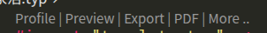

# 文档撰写规范

- 统一使用中文标点
- 若行内出现的英文单词在语境下是一个变量/值/类型，请使用`行内代码`
- 行间代码需标明语言类型
- 表格内的有序列表的数字后面只有**1个**空格，即`1. xxx`

## Typst

- 为便于排版，协作和版本控制，所有需要对外上交的文档使用 Typst 撰写。

### 配置环境

- 请在 *VS Code* 中完成所有 Typst 文档的撰写
- 安装以下插件
  - [Tinymist Typst](https://marketplace.visualstudio.com/items?itemName=myriad-dreamin.tinymist)
  - [Typst Companion](https://marketplace.visualstudio.com/items?itemName=CalebFiggers.typst-companion)
- 安装常用字体：<https://box.nju.edu.cn/d/2888720a333e488ca895/>

### 预览和导出文档

- 在 VS Code 中打开 Typst 文档，稍等片刻后，文档顶部会出现一行按钮。
- 点击 **Preview** 即可在 VS Code 内部实时预览文档，同时会在文档所在目录生成一个同名的 PDF 文件。



### 语法

```typst
= 一级标题 // 标题前后请空一行

== 二级标题

=== 三级标题

- 无序列表
- 无序列表
  - 二级无序列表
    - 三级无序列表


+ 有序列表
+ 有序列表
  + 二级有序列表
    + 三级有序列表

`行内代码`

*加粗*

_斜体_

\`\`\`语言类型
行间代码
\`\`\`

// 注释

// 插入图片
#figure(
  image("glacier.jpg", width: 70%),
  caption: [
    _Glaciers_ form an important part
    of the earth's climate system.
  ],
)

// 链接
#link("链接地址")[链接文本]
```

- [数学公式](https://zhuanlan.zhihu.com/p/643860286)
- [引用文献](https://typst.app/docs/reference/model/cite/)
- 更多语法和帮助可参考[官方文档](https://typst.app/docs/)
