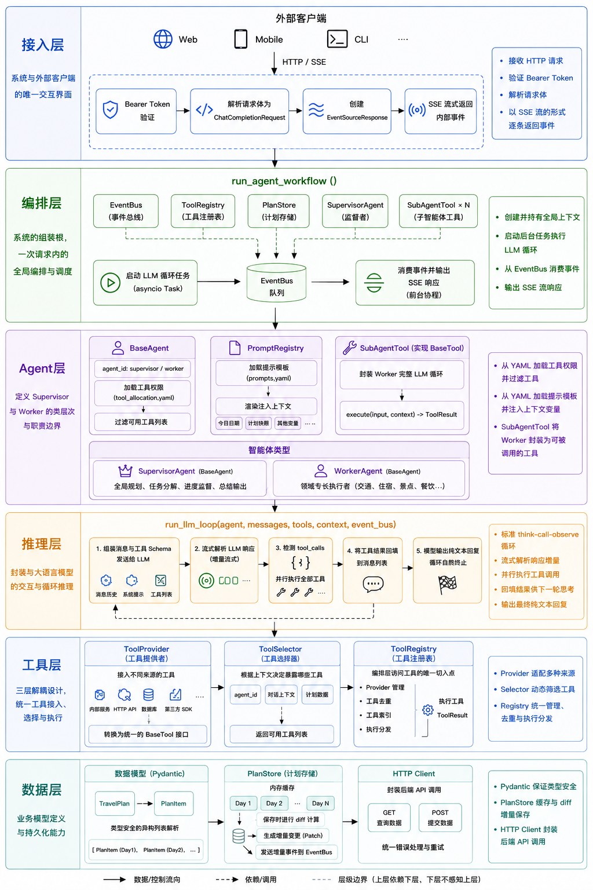
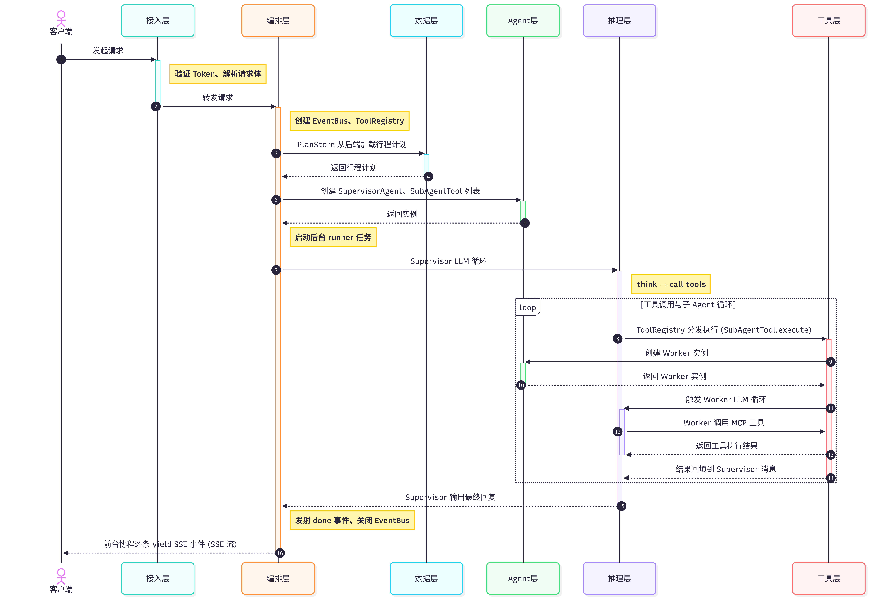

# Agent 详细设计文档

## 概述与设计目标

### 系统定位

本系统是一个 Multi-Agent 框架，面向旅游行程规划领域构建。系统接收用户的自然语言请求，由智能体自主决策，进行交通、酒店、景点、餐饮等方面的行程设计，最终整合结果写入行程计划并回复用户。

系统采用 Python 3.12+ 与 FastAPI 构建，通过 OpenAI SDK 驱动大语言模型推理，以 Server-Sent Events 协议向客户端流式推送内部事件。

### 核心设计决策

#### Supervisor-Worker 模式

系统采用 Supervisor-Worker 多智能体架构。Supervisor 负责全局规划与决策，Worker 专注于各自领域的子任务执行。这种模式符合人类的分工协作习惯，更节约上下文，且易于通过工具调用机制实现层次化的任务委派。

#### Worker 即工具

Worker 智能体被封装为 Supervisor 工具列表中的普通函数调用。Supervisor 与 Worker 之间的通信完全通过工具调用接口实现，彼此不直接依赖对方的内部实现。这使得 LLM 能够原生的 function-calling 能力自主调度多智能体协作，无需额外的编排代码，使系统的执行更灵活。

#### SSE 反应式管线

在 Agent 系统进行推理与工具调用的过程中，系统会产生大量的中间状态变更，如 Worker 启动、思考状态、工具调用与结果等。系统将这些事件全部封装为结构化事件对象，并全部推入 `EventBus` 异步队列，由 HTTP SSE 端点消费并推送给前端。这使得前端可以实时观测 Supervisor 与 Worker 的每一步决策过程。

## 系统分层架构

系统按照数据流动方向与依赖关系，自顶向下划分为六个层次。上层依赖下层，下层绝不感知上层。



### 接入层

接入层是系统与外部客户端的唯一交互界面。它接收 HTTP 请求、验证 Bearer Token、将请求体解析为 `ChatCompletionRequest` 模型、创建 `EventSourceResponse` 并以 SSE 流的形式逐条返回内部事件。

### 编排层

编排层是系统的组装根。`run_agent_workflow()` 函数在一次请求内创建 `EventBus`、`ToolRegistry`、`PlanStore` 上下文、`SupervisorAgent` 及全部 `SubAgentTool`，启动后台 `asyncio` 任务执行 LLM 循环，前台协程从 `EventBus` 队列消费事件并输出 SSE 响应。

### Agent 层

Agent 层定义了 Supervisor 与 Worker 的类层次。`BaseAgent` 从 `tool_allocation.yaml` 读取工具权限并据此过滤工具列表。`PromptRegistry` 从 `prompts.yaml` 加载模板，在渲染阶段注入当天日期、计划快照等上下文变量。`SubAgentTool` 将 Worker 的完整 LLM 循环包装为符合 `BaseTool` 协议的 `execute()` 方法。

### 推理层

推理层封装与大语言模型的交互。`run_llm_loop()` 实现标准的 think-call-observe 循环：组装消息与工具 schema 发送给 OpenAI、流式解析响应增量、当模型返回 `tool_calls` 时并行执行全部工具、将结果回填到消息列表供下一轮思考。循环在模型输出纯文本回复时自然终止。

### 工具层

工具层实现三层解耦设计。`ToolProvider` 接入不同来源的工具并转换为统一的 `BaseTool` 接口；`ToolSelector` 根据 `agent_id` 等上下文决定暴露哪些工具；`ToolRegistry` 作为编排层访问工具的唯一切入点，负责 `Provider` 管理、工具去重、执行分发。

### 数据层

数据层定义业务模型并提供持久化能力。`TravelPlan` 与 `PlanItem` 使用 Pydantic 保证类型安全的异构列表解析。`PlanStore` 在内存中缓存行程计划，保存时进行 diff 计算，并发送增量变更。`HTTP Client` 封装对后端 API 的 `GET` 与 `POST` 调用。

### 一次请求的完整时序

一次典型的用户请求穿越全部六层，其完整时序如下。



## 接入层：API 与 SSE 协议

### Chat Completion 接口

系统暴露唯一接口：

```text
POST /api/v1/chat/completions
Authorization: Bearer <token>
Content-Type: application/json
```

该接口对标 OpenAI Chat Completions API 的语义，但强制流式模式。请求体中 `stream` 字段必须为 `true`，否则返回错误。

接口实现在 `src/api/routers/chat.py` 中。处理流程分为四步。第一步，从 `Authorization` 头提取 Bearer Token 并验证。第二步，将请求体解析为 `ChatCompletionRequest` Pydantic 模型。第三步，检查 `stream` 字段是否为 `true`。第四步，调用 `run_agent_workflow()` 获取异步生成器，包装为 `EventSourceResponse` 返回。

### 请求模型

`ChatCompletionRequest` 定义如下字段。

- `messages: list[ChatMessage]` — 完整的对话历史。客户端负责维护历史并在每次请求中全量发送。每条消息含 `role`、`content`、可选的 `tool_calls` 和 `tool_call_id`。
- `stream: bool` — 必须为 `true`。
- `agent_id: Optional[str]` — 当前未使用，预留用于多租户路由。
- `schedule_id: Optional[int]` — 行程计划 ID。
- `metadata: Optional[dict]` — 扩展元数据。其中的 `prompt_overrides` 键可用于在运行时覆盖 prompt 模板。

### SSE 事件协议

系统通过 SSE 向客户端推送 9 种事件。每种事件的 `event` 字段为事件类型字符串，`data` 字段为 JSON 编码的负载。

- `node_start` 事件：表示一个 Worker 智能体开始执行。负载含三个字段：`id` 为该节点在本次请求中的唯一标识，由 `agent_key` 与 `schedule_id` 拼接而成；`parent` 为 Supervisor 节点的标识；`msg` 固定为 `"start"`。
- `thought` 事件：表示 Worker 智能体的思考状态变更。负载含 `content` 字段，内容为简短状态描述如 `"Agent hotel is thinking..."`。
- `tool_call` 事件：在工具被调用时发射。负载含 `call_id` 为 OpenAI 返回的工具调用标识，`tool_name` 为工具名称。
- `tool_result` 事件：在工具返回结果时发射。负载含 `call_id` 与 `result`。`result` 字段被截断为 300 字符以内，避免庞大的工具结果撑满 SSE 通道。
- `message_delta` 事件：在 Supervisor 生成回复文本时发射。不同于 `thought` 事件仅用于 Worker，`message_delta` 承载 Supervisor 面向用户的最终回复。delta 内容以 20 字符为批次聚合后推送，以平衡实时性与网络开销。
- `tool_progress` 事件：在行程计划保存过程中发射，用于向前端报告保存进度。负载含 `msg` 字段。
- `node_finish` 事件：表示 Worker 智能体执行完毕。负载含 `id` 与 `status` 字段，`status` 值为 `"success"`。
- `done` 事件：表示整个工作流执行完毕。负载含 `status` 字段，`"success"` 或 `"error"`。成功时附带 `usage` 对象，包含 `prompt_tokens`、`completion_tokens` 与 `total_tokens`。
- `error` 事件：在工作流异常时发射。负载含 `code` HTTP 状态码与 `message` 错误描述。

### 鉴权

Token 验证逻辑位于 `verify_token()` 函数。当前实现为从环境变量加载允许的 token 列表并做精确匹配。验证失败时返回 HTTP 401。

## 编排层：工作流组装与事件总线

### 双协程模型

编排层采用双协程设计：一个后台 `asyncio` 任务执行 LLM 循环并将事件推入队列，一个前台协程从队列消费事件并 `yield` 给 SSE 响应。这两个协程通过 `EventBus` 解耦，runner 不关心事件的消费者，SSE 消费者不关心事件的生产者。

系统采用双协程模型以应对 LLM 循环中可能出现的长时间阻塞。LLM 循环是长时间运行的计算密集型任务；若将其内联在 SSE 生成器中，一旦 LLM API 阻塞，客户端将收到长时间静默，无法区分“系统在运行”与“连接已断开”。双协程模型使 SSE 消费者始终能从队列中快速取出并推送事件。

### `run_agent_workflow` 组装流程

`run_agent_workflow()` 是编排层的入口函数，接受 `ChatCompletionRequest` 与 `token` 两个参数，返回 `AsyncGenerator`。其组装流程分为以下步骤。

1. 通过 `set_token()` 与 `set_bus()` 将 `token` 和 `EventBus` 注入 `ContextVar`，使 `PlanStore` 等下游组件无需显式传参即可访问请求级状态。
2. 创建 `EventBus` 实例。
3. 调用 `create_registry()` 创建 `ToolRegistry` 实例。该函数注册 `LocalProvider` 与全部三个 `MCPProvider`，并注入 `AllToolsSelector`。
4. 从请求中提取 `schedule_id` 与元数据，注入 `ToolRegistry`，调用 `plan_store.load_plan()` 从后端加载行程计划，获取计划的 JSON 快照用于填充 prompt 上下文。
5. 构建 `session_ctx` 字典，汇集 `schedule_id`、`plan_snapshot`、`user_request`、`metadata` 与 `supervisor_id`，作为各组件共享的会话上下文。
6. 创建 `SubAgentTool` 列表。从 `tool_allocation.yaml` 的 `supervisor.subagents` 字段读取配置的 Worker 键，对每个键查表获取对应的 Worker 类，实例化 `SubAgentTool` 并注入 `_tool_map`，使 Supervisor 能像调用普通工具一样调用它们。
7. 创建 `SupervisorAgent` 实例，获取其工具列表。Supervisor 的最终工具列表 = Supervisor 自身工具 + `SubAgentTool` 列表。
8. 构建 Supervisor 的消息列表，包含 system prompt 与 user prompt。
9. 定义并启动 `_runner` 后台任务。`_runner` 内部的流程为：发射 `node_start` → 调用 `run_llm_loop()` → 发射 `node_finish` → 发射 `done` → 关闭 `EventBus`。异常时改为发射 `error` 再发射 `done`。
10. 前台循环从 `bus.sink().get()` 消费事件。当收到 `None` 哨兵时退出循环，等待 runner 任务完成。

### `EventBus` 设计

`EventBus` 的核心是一个 `asyncio.Queue`。`emit()` 方法构造 `ServerSentEvent` 对象并 `put()` 入队列。`sink()` 方法直接返回底层 `asyncio.Queue` 引用供消费者使用。`close()` 方法向队列中放入一个 `None` 哨兵，通知消费者流已结束。

EventBus 的实例化时机是每次请求开始时，生命周期与单次请求绑定。关闭后不得再向其中发射事件。

## Agent 层：智能体系统

### 类层次结构

Agent 层包含三个类与一个工具适配器。

#### `BaseAgent`

`BaseAgent` 是所有智能体的基类。其构造函数接受 `agent_id`、`tool_registry`、`prompt_provider` 与可选的 `metadata`、`allowed_tool_names`、`allowed_tool_prefixes`。若调用方未显式传入工具约束，则从 `tool_allocation.yaml` 中按 `agent_id` 加载默认配置。

#### `SupervisorAgent`

`SupervisorAgent` 继承 `BaseAgent`，对应 `agent_id = "supervisor"`。它提供 `build_plan_messages()` 方法，构建 `[system, user]` 两条初始消息供推理层启动循环。

#### `WorkerAgent`

`WorkerAgent` 继承 `BaseAgent`，是所有领域 Worker 的基类。它提供 `build_task_messages(task, context)` 方法，接受 `TaskSchema` 对象与上下文字典，构建 Worker 视角的消息列表。

四个具体 Worker（`TrafficAgent`、`HotelAgent`、`AttractionAgent`、`FoodAgent`）均为 `WorkerAgent` 的空子类。其行为差异完全由 `prompts.yaml` 中的不同 system prompt 和 `tool_allocation.yaml` 中的不同工具权限决定，无需额外代码。

#### `SubAgentTool`

`SubAgentTool` 是一个遵循 BaseTool 协议的适配器。它将 Worker 的完整 LLM 循环封装进 `execute()` 方法，使 Worker 能够作为 Supervisor 的工具被调用。

### 工具过滤机制

`BaseAgent.get_tools()` 从 `ToolRegistry` 获取全部可用工具后，调用 `_filter_tools()` 按两类规则过滤。

- **精确名称匹配**：`allowed_tool_names` 集合中的工具名直接放行。
- **前缀匹配**：`allowed_tool_prefixes` 列表中的每个前缀，匹配所有以该前缀开头的工具名。例如 `traffic` Agent 配置前缀 `["variflight_", "12306_", "amap_"]`，即可访问三个 MCP Provider 的全部工具，而不会看到本地 save 工具。

若两个约束均为空，则不过滤，返回全部工具。

工具约束的默认值从 `tool_allocation.yaml` 加载。该文件在 `BaseAgent` 模块加载时一次性解析并缓存在 `_ALLOCATION` 字典中。以下是配置文件的结构示例。

```yaml
supervisor:
  tools: [get_travel_plan, save_attraction, save_hotel,
          save_food, save_transport_long, save_transport_short]
  subagents: [traffic, hotel, attraction, food]

traffic:
  prefixes: [variflight_, "12306_", amap_]

hotel:
  prefixes: [amap_]

attraction:
  prefixes: [amap_]

food:
  prefixes: [amap_]
```

其中 `supervisor.subagents` 字段被编排层读取，用于动态创建 SubAgentTool 列表。

### SubAgent 即工具

`SubAgentTool` 是连接 Supervisor 与 Worker 的桥梁。它同时实现了工具的外观与 Agent 的执行语义。

#### 工具端外观

`SubAgentTool` 具备 `name`、`description` 和 `schema` 三个属性，完全符合 `BaseTool` 协议。`name` 的命名规则为 `"delegate_" + agent_key`，例如 `delegate_traffic`。`schema` 暴露单一参数 `task: string`，表示分配给该 Worker 的任务描述。

#### Agent 端执行语义

当 Supervisor 的 function-calling 触发 `execute(**kwargs)` 时，`SubAgentTool` 执行以下流程。

1. 从 `kwargs` 提取 `task` 参数。
2. 通过 `plan_store.get_plan_snapshot()` 获取最新计划快照。
3. 实例化对应的 Worker 类。
4. 构建 `TaskSchema` 与 context 字典。
5. 调用 `worker.build_task_messages()` 构建消息。
6. 调用 `worker.get_tools()` 获取经过过滤的 Worker 工具列表。
7. 发射 `node_start` SSE 事件。
8. 调用 `run_llm_loop()` 执行 Worker 的完整推理循环。
9. 发射 `node_finish` 事件。
10. 返回 Worker 的最终文本作为工具结果。

Worker 运行的 LLM 循环与 Supervisor 运行的是同一套 `run_llm_loop()` 函数，区别在于消息内容、工具列表与 SSE 事件类型不同。Supervisor 使用 `stream_event="message_delta"` 向上游推送回复，Worker 使用 `stream_event="thought"` 仅推送思考状态。

### Prompt 系统

`PromptRegistry` 在模块级别加载 `prompts.yaml` 并缓存在 `_PROMPT_DATA` 字典中。该文件为每个 Agent 定义了两段 prompt：`system` 为系统角色设定，`task` 为具体任务指令。

`get_system_prompt(agent_id, context)` 返回渲染后的 system prompt。渲染过程将 context 字典中的变量替换模板中的占位符。自动注入的变量包括 `date_hint`，以提示当前日期。

`get_task_prompt(agent_id, task, context)` 返回渲染后的 task prompt。若 task 参数非空，其字段被注入模板。

运行时 prompt 覆盖通过请求中 `metadata.prompt_overrides` 字段实现。`PromptRegistry` 构造函数接收该字典，`_render_template()` 方法在渲染前将覆盖值合并到 context 中，优先级高于自动注入的默认值。

在 Prompt 的设计中，静态的 system prompt 置于整个 Prompt 的顶部，动态的内容置于 Prompt 的最后，这样可以充分利用模型服务商的缓存机制，提升缓存利用率，进而加快响应速度。

## 推理层：LLM 循环引擎

### 主循环算法

推理层的核心是 `run_llm_loop()` 函数。它实现 think-call-observe 循环，位于 `src/core/llm_loop.py`。

函数签名为：

```python
async def run(
    *,
    node: str,
    messages: List[Dict[str, Any]],
    tools: List[BaseTool],
    bus: Optional[EventBus],
    tools_registry: ToolRegistry,
    stream_event: str = "thought",
    max_iterations: int = MAX_LLM_ITERATIONS,
) -> LLMResult:
```

参数 `node` 为当前执行的 Agent 名称，用于 SSE 事件标识。`messages` 为初始消息列表。`tools` 为可用工具列表。`bus` 为事件总线。`tools_registry` 为工具注册中心。`stream_event` 控制文本增量事件的事件类型。`max_iterations` 默认为 10，来源于环境变量 `MAX_LLM_ITERATIONS`。

#### 循环步骤

1. 组装 API 调用参数。消息列表、工具 schema 列表、流式标志被传入 `client.chat.completions.create()`。
2. 若当前为 thought 模式，发射一条初始 thought 事件通知前端该 Agent 开始思考。
3. 调用 `_parse_response_stream()` 逐 chunk 解析 OpenAI 的流式响应。对于 `message_delta` 事件，当累积字符数达到 20 时发射给 EventBus。
4. 流结束时获得解析结果，包含生成的文本、工具调用列表、completion token 数。
5. 若无工具调用，将 assistant 消息追加到消息列表，循环终止。
6. 若有工具调用，将 assistant 消息追加到消息列表，调用 `_execute_tool_calls()` 并行执行全部工具，将工具结果消息追加到消息列表，进入下一轮迭代。

#### 循环终止条件

循环终止条件有两种情况。其一是本轮 LLM 响应不包含 `tool_calls`，即模型认为无需继续调用工具，直接输出文本回复，对应 OpenAI 的 `finish_reason=stop`。其二是迭代次数达到 `max_iterations` 上限，强制终止以防止无限循环。

#### 返回值

函数返回 `LLMResult` 对象，包含最终文本 `text`、完整消息历史 `messages`、prompt token 估计值 `prompt_tokens`、completion token 累计值 `completion_tokens`。

### 流式响应解析

`_parse_response_stream()` 是一个异步生成器，逐块消费 OpenAI 的 SSE 响应流并产出结构化结果。

解析逻辑处理两种增量数据。`delta.content` 为非空时，将文本片段追加到 `_text_parts` 列表，并即时 yield `("message_delta", text)` 让上层实时推送。`delta.tool_calls` 为非空时，按 `tc.index` 索引累积到 `tool_calls_buffer`。每个 tool call 的 `function.arguments` 分片被追加到对应的 `_tool_args_parts[idx]` 列表中。

流结束时，将每个索引的 arguments 分片拼接为完整 JSON 字符串，存入 `tool_calls_buffer[idx]["function"]["arguments"]`，然后 yield 一个 `("stream_end", {...})` 元组，包含 `text`、`tool_calls` 与 `completion_tokens`。

这种分片拼接机制处理了 OpenAI 可能将一个 tool call 的 arguments 拆分到多个 chunk 中返回的情况。

### 工具并行执行

当 LLM 在一轮迭代中返回多个 tool_calls 时，`_execute_tool_calls()` 通过 `asyncio.gather()` 并发执行全部调用。每个工具调用由 `_execute_one_tool()` 处理。

`_execute_one_tool()` 的执行流程。首先解析 arguments JSON 字符串为字典。然后发射 `tool_call` SSE 事件。接着进行工具名白名单校验，若不在 `allowed_tool_names` 中则抛出 `ValueError`。校验通过后调用 `tools_registry.execute_tool()` 执行工具。结果序列化为 JSON 字符串后发射 `tool_result` 事件，result 截断为前 300 字符。若执行过程中任何步骤抛出异常，将异常信息作为错误字符串返回而非中断循环。最后返回符合 OpenAI tool result 格式的消息：`{"role": "tool", "tool_call_id": ..., "name": ..., "content": ...}`。

并行执行的设计是必要的。当 Supervisor 同时需要交通方案与酒店方案时，它可以在一次推理中发出 `delegate_traffic` 与 `delegate_hotel` 两个调用。若串行执行，两个 Worker 将顺序运行，总耗时为两者之和；并行执行使得总耗时约等于较慢的那个 Worker，显著缩短响应时间。

### Token 估算

prompt token 数采用简化估算：将消息列表序列化为 JSON 字符串，取其字节长度的四分之一作为 token 数近似值。completion token 数为流解析过程中实际累计的 chunk 数量。两者之和作为 `total_tokens` 在 `done` 事件中返回给客户端。

## 工具层：工具引擎

### 三层解耦设计

工具引擎层按照职责将工具系统拆分为三个角色：Provider、Selector、Registry。三者的接口定义为 Protocol 类型，位于 `src/services/tools/base.py`。

**BaseTool 协议**定义了任何工具必须提供的接口。`name: str` 为工具的唯一标识。`description: str` 为给 LLM 看的描述文本。`schema: dict` 为兼容 OpenAI function-calling 格式的 JSON Schema。`execute(**kwargs) -> Any` 为异步方法，执行工具核心逻辑。

**ToolProvider 协议**定义了工具的来源。`name: str` 为 Provider 标识。`get_tools() -> List[BaseTool]` 为异步方法，获取该 Provider 下所有可用工具。

**ToolSelector 协议**定义了工具的选择策略。`select(available_tools, context) -> List[BaseTool]` 为异步方法，根据 `ToolCallContext` 从可用工具中筛选出应暴露给当前 LLM 的工具子集。

**ToolCallContext** 携带智能体的身份信息。`agent_id` 标识当前请求的 Agent。`metadata` 字典携带额外的会话属性。

三个角色的职责边界明确。Provider 回答“有哪些工具可用”。Selector 回答“当前该给模型看哪些工具”。Registry 回答“某个工具由谁执行、如何执行”。

### ToolRegistry

`ToolRegistry` 是编排层访问工具系统的唯一入口。它聚合多个 Provider，委托 Selector 过滤，维护工具名称到实例的映射表供快速执行分发，并自动向工具参数注入 `schedule_id`。

`add_provider(provider)` 方法注册一个 Provider。Provider 的实际添加发生在 `create_registry()` 工厂函数中。

`get_tools_for_agent(context)` 方法遍历全部 Provider 获取工具列表，将工具存入 `_tool_map` 缓存。若发现同名工具但类型不同，抛出 `ValueError` 阻止注册。随后将完整工具列表传递给 Selector 过滤，返回筛选后的列表。

`execute_tool(name, params)` 方法从 `_tool_map` 中查找工具实例。找到后自动注入 `schedule_id`。若 `params` 中尚不存在该键，则从 `_schedule_id` 属性中取值并设置为默认。然后调用 `tool.execute(**params)` 并返回结果。

`_tool_map` 不仅包含 Provider 提供的工具，还包含编排层直接注入的 `SubAgentTool`。编排层在创建 `SubAgentTool` 后通过 `tool_registry._tool_map[tool.name] = tool` 手动注册。这使得 Supervisor 的工具列表中同时出现本地工具、MCP 工具与 SubAgent 工具，三者从 Registry 的视角无区别。

### LocalProvider 与本地工具

`LocalProvider` 是最简单的 Provider 实现。它维护一个工厂函数列表，`get_tools()` 时遍历工厂函数并调用它们以获取工具实例。

本地工具共 6 个，位于 `src/services/tools/local/` 下。

`get_travel_plan` 从 PlanStore 获取缓存的行程计划 JSON 快照并返回。它是只读工具，不产生副作用。

`save_attraction`、`save_hotel`、`save_food`、`save_transport_long`、`save_transport_short` 五个工具分别负责保存对应类型的计划项。它们的执行流程一致：接收一个 `items` 列表参数，将每个元素构造为带类型化 details 的 `PlanItem` 对象，然后调用 `PlanStore.save_plan()` 进行 diff 增量保存。每个工具都定义了详细的 OpenAI function schema，包含 `required` 字段约束、`enum` 值限制与中文描述。

### MCPProvider 与外部工具接入

MCPProvider 是本系统最复杂的 P`rovider` 实现，负责通过 MCP 协议与外部 Node.js 工具服务器通信。位于 `src/services/tools/mcp/provider.py`。

#### 子进程生命周期管理

每个 MCPProvider 在构造函数中持有 `command`、`args` 与 `env` 配置。首次调用 `_ensure_session()` 时，通过 `stdio_client()` 启动 Node.js 子进程并建立 MCP 会话。子进程通过 `asyncio.create_task()` 在后台维持，会话通过 `_bg_ready` 事件同步等待就绪。子进程的生命周期为进程级，整个 Python 应用运行期间不重启，除非发生异常触发重连。

#### 连接池设计

MCP 的 stdio 通道不支持请求复用，因此对同一 Provider 的所有工具调用必须串行化。`_call_lock` 是 `asyncio.Lock` 实例，`call_remote_tool()` 通过 `async with self._call_lock` 确保同一时刻只有一个请求在 stdio 通道上通信。工具列表缓存通过 `_cache_lock` 双重检查锁定来保证线程安全的单次加载。

#### Schema 清洗

MCP 服务器返回的工具 inputSchema 可能包含 `$schema`、`$id`、`$defs`、`definitions`、`title` 等 OpenAI 不接受的 JSON Schema 关键字。`_deep_clean_schema()` 递归删除这些禁止键。若 `type` 为 `"object"` 但缺少 `properties` 键，自动补全为空 `properties: {}`。

#### 内容规范化

MCP SDK 的 `call_tool()` 返回的 `content` 可能是 `TextContent`、`ImageContent` 或 `ResourceContent` 对象，它们不能直接 JSON 序列化。`_normalize_content()` 递归遍历返回结构，将 MCP 对象转换为标准 dict 或 list，保留 `type` 与 `text`/`data` 字段。

#### 错误处理与重试

`call_remote_tool()` 设置 30 秒超时。超时时返回结构化错误信息而非抛出异常。若调用失败，执行最多一次重试。重试仍失败则抛出异常由上层捕获。

#### MCPToolAdapter

每个远程工具被包装为 `MCPToolAdapter` 实例。它持有对 Provider 的引用与远程工具名，将 `execute()` 代理到 `provider.call_remote_tool()`。工具名加前缀以避免冲突，例如高德地图的 `geo` 工具暴露为 `amap_geo`。

#### 已接入的 MCP 服务

- **AmapProvider**：高德地图 MCP。通过 `npx -y @amap/amap-maps-mcp-server` 启动，工具名前缀 `amap_`，需环境变量 `AMAP_MAPS_API_KEY`。
- **RailwayProvider**：12306 铁路 MCP。通过 `npx -y 12306-mcp` 启动，工具名前缀 `12306_`，无需 API Key。
- **VariflightProvider**：飞常准航班 MCP。通过 `npx -y @variflight-ai/variflight-mcp` 启动，工具名前缀 `variflight_`，需环境变量 `VARIFLIGHT_API_KEY`。

三个 Provider 在 `create_registry()` 中被创建一次并作为进程级单例。`get_tools()` 的首次调用触发实际连接，后续请求复用已建立的会话。

## 数据层：数据模型与持久化

### 行程计划数据模型

数据模型定义在 `src/schemas/plan.py` 中，核心是两个类：`PlanItem` 与 `TravelPlan`。

`PlanItem` 表示行程计划中的单个条目。其字段包括：

- `id: Optional[int]` — 条目在后端数据库中的唯一标识，新建条目的 id 为 None。
- `type: Literal["attraction", "hotel", "food", "transport_long", "transport_short"]` — 条目类型枚举。
- `name: str` — 条目名称。
- `start_time: str` — 开始时间。
- `end_time: str` — 结束时间。
- `notes: str` — 备注。
- `status: Literal["planned", "booked", "completed", "cancelled"]` — 状态枚举，默认为 `"planned"`。
- `cost: int` — 费用，默认为 0。
- `details: PlanItemDetails` — 类型化的详情对象。

`PlanItemDetails` 是 Pydantic discriminated union，按 `type` 字段的值分发到五种具体类型。

#### `AttractionDetails`

表示景点详情。含 `type: "attraction"` 字面值、`suggested_duration` 建议游玩时长、`opening_hours` 开放时间、`booking_reference` 预订编号、`location: Location` 与 `tags: list[str]`。

#### `HotelDetails`

表示住宿详情。含 `type: "hotel"` 字面值、`contact_phone`、`room_type` 房型、`booking_reference`、`location` 与 `tags`。

#### `FoodDetails`

表示餐饮详情。含 `type: "food"` 字面值、`recommend_dishes` 推荐菜品列表、`opening_hours`、`location` 与 `tags`。

#### `TransportLongDetails`

表示长途交通详情。含 `type: "transport_long"` 字面值、`transport_mode: Literal["flight", "train", "coach", "ferry"]` 交通方式枚举、`departure_station`、`arrival_station`、`vehicle_number`、`seat_info`、`booking_reference`、`departure_location: Location` 与 `arrival_location: Location`。

#### `TransportShortDetails`

表示短途交通详情。含 `type: "transport_short"` 字面值、`routes: list[Route]`、`departure_location` 与 `arrival_location`。

#### 其余通用数据模型

通用模型 `Location` 含 `poi_id`、`poi_name`、`address`、`lng`、`lat` 五个字段。`Route` 含 `estimated_duration`、`route_description`、`navigation_link` 三个字段。

`TravelPlan` 为顶层容器，含 `version: int` 与 `items: list[PlanItem]` 两个字段。

### Discriminated Union 机制

Pydantic 的 discriminated union 通过 `Field(discriminator="type")` 声明。每个 details 类型的 `type` 字段被设为字面值：`"attraction"`、`"hotel"` 等。当 Pydantic 解析 `PlanItem` 时，先读取 `details` 中的 `type` 值，再将其路由到对应的具体类进行验证。这保证了类型安全：若 `type` 为 `"hotel"` 但 details 中缺少 `room_type`，验证失败。

### Schema 预热

`src/schemas/plan.py` 在模块末尾创建了一个虚拟的 `TravelPlan` 实例 `_TravelPlan`。其目的是强制 Pydantic 在 import 时完成 discriminated union 的首次编译与验证器构建，从而提升后续实际使用时的性能，避免首次请求时出现较长的验证延迟。

### PlanStore 与持久化

`PlanStore` 是单例类，位于 `src/travel_plan/plan_store.py`。它维护行程计划的内存缓存与 JSON 快照。

`load_plan(schedule_id)` 从后端 API 获取指定 schedule_id 的完整行程计划，解析为 `TravelPlan` 对象存入 `_cache` 字典，同时存储 JSON 字符串版本到 `_snapshots` 字典供 prompt 渲染使用。`get_plan_snapshot(schedule_id)` 直接从 `_snapshots` 返回缓存的 JSON 字符串，避免重复序列化开销。

`save_plan(schedule_id, plan)` 实现 diff-based 增量保存。首先确保计划已加载。然后与当前缓存的计划对比，按 `id` 字段找出新增的条目。对每个新增条目，调用后端 `add_plan_item` API 逐个保存。过程中通过 EventBus 发射 `tool_progress` 事件向前端报告进度。

这种设计意味着在 `save_plan` 时，已保存的条目不会被覆盖。Worker 产出的条目通常在 LLM 生成阶段没有 `id`，与缓存中已有条目对比时自然被识别为新增。

### ContextVar 传递请求状态

`PlanStore` 的方法需要 token 用于后端 API 鉴权，需要 EventBus 用于发射进度事件。但 `PlanStore` 是模块级单例，不应在每次方法调用时传递这些请求级参数。系统使用 Python 的 `contextvars.ContextVar` 解决此问题。

`set_token()` 与 `set_bus()` 在编排层的 `run_agent_workflow()` 入口处设置 ContextVar 的值，`get_token()` 与 `get_bus()` 在 `PlanStore` 方法内部获取。ContextVar 是 asyncio 原生支持的线程安全、协程安全变量，在并发请求场景下不会发生状态串扰。

### 后端 HTTP 客户端

`src/travel_plan/client.py` 封装对后端 API 的 HTTP 调用。`get_plan(schedule_id)` 发 GET 请求到 `/schedule/plan/{schedule_id}`。`add_plan_item(item_data)` 发 POST 请求到 `/plan/agent/add`。两个函数均从 `Authorization: Bearer` 头传递 token。

## 配置系统

### Prompt 配置

`src/agents/prompts.yaml` 定义每个 Agent 的 system prompt 与 task prompt 模板。模板使用 Python 字符串的 `{variable}` 占位符语法，在 `PromptRegistry` 渲染时替换为 context 中的对应值。

渲染阶段自动注入的变量 `date_hint` 包含当前日期与建议的行程起始日期，帮助 LLM 进行时间推理。

### 工具分配配置

`src/agents/tool_allocation.yaml` 定义每个 Agent 的工具权限。`supervisor.subagents` 字段声明哪些 SubAgent 应当被包装为工具。编排层读取该字段后动态创建对应的 `SubAgentTool`。

### 环境变量

系统依赖以下环境变量。

- `OPENAI_MODEL` — OpenAI 模型名称，默认 `"gpt-4o-mini"`。
- `MAX_LLM_ITERATIONS` — LLM 最大循环迭代次数，默认 10。
- `BACKEND_API_BASE_URL` — 行程计划后端 API 的基础 URL。
- `AUTHORIZED_TOKENS` — 允许的 Bearer Token，逗号分隔。
- `AMAP_MAPS_API_KEY` — 高德地图 API Key。
- `VARIFLIGHT_API_KEY` — 飞常准 API Key。

### 运行时覆盖

Prompt 模板支持运行时覆盖。请求方可在 `metadata.prompt_overrides` 中传入一个字典，键为 `{agent_id}.system`、`{agent_id}.task` 等路径，值为替换模板文本。`PromptRegistry` 在渲染前检查是否有匹配的覆盖值，有则使用覆盖值而非 YAML 中的默认模板。这允许前端在不修改部署文件的情况下临时调整 Agent 行为。

## 部署架构

### Docker 镜像

Dockerfile 基于 `python:3.12-slim` 构建，额外安装 Node.js 运行时以支持 MCP 服务器通过 npx 启动。这意味着容器内同时具备 Python 3.12 和 Node.js 两个运行时。

### CI/CD 管线

项目同时配置了 GitLab CI 与 GitHub Actions 两条管线。GitLab CI 管线定义在 `.gitlab-ci.yml`，负责部署流程。GitHub Actions 含 `deploy.yml` 与 `docker-build.yml`，分别负责部署与 Docker 镜像构建。

### 运行环境

应用通过 `uvicorn` 启动 FastAPI 应用。`main.py` 挂载了 `src/api/routers/` 下的路由模块，配置了 CORS 中间件。启动命令的标准形式为：

```bash
uvicorn main:app --host 0.0.0.0 --port 8000
```

Python 依赖通过 uv 管理，`pyproject.toml` 声明项目元数据与依赖列表，`uv.lock` 锁定精确版本。
