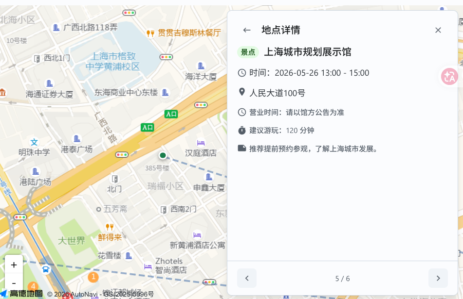
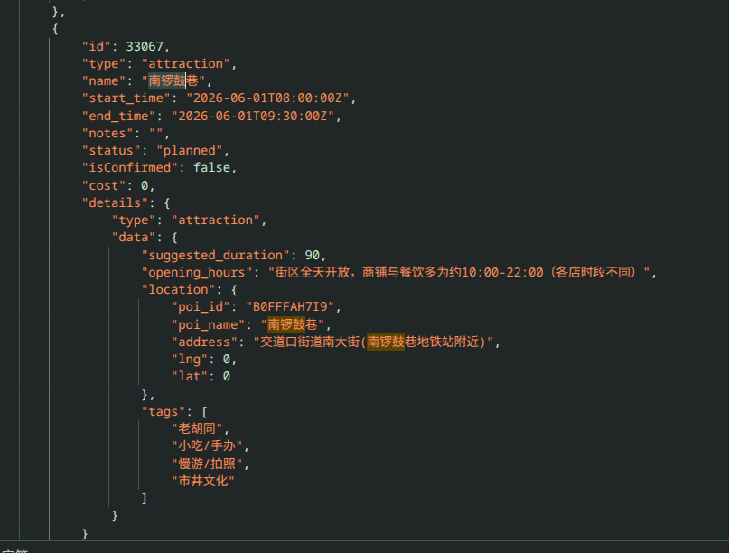
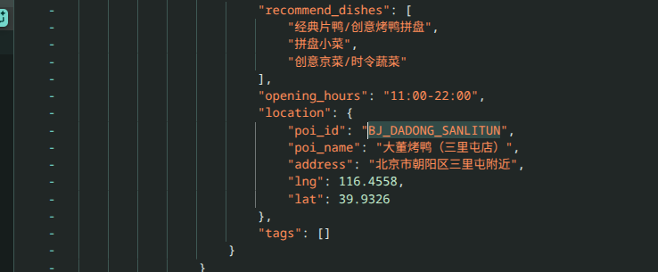
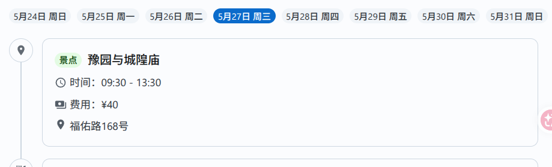

# 260520

## 议程

1. 确认上周任务完成情况
2. 迭代 3 进度 & 任务分配
3. 迭代 3 分工调整

## 最后两周需要完成的内容

### Agent

- Skill：为旅行规划的用户提供预设的 skill，用户可以选择加入到聊天中
  - 引入 Bash 环境
  - 使用 Bash 环境渐进式的披露 Skill 的信息
  - 6/3 开会时，和后端再对接
- 用户选择启用/禁用工具：如何应用到我们的场景中？
  - 基于用户选择的交通方式，向 agent 提供对应的工具
  - 用户没选择乘火车，就禁用 12306 工具
- 多模态
- 修复下面存在的问题
  - 编辑/删除计划工具失效
  - 定位偏移、经纬度为空、POI 产生幻觉、时间冲突、行程合理性/顺直度、一个计划项中有多个地点
- WebSerach 工具？
- Agent 自主唤起应急信息？
- RAG：是否还需要？不要

### 评估

- 发现的 Bad Case
  - 输出地点的准确性
    - 定位偏移（tools 里优化/在写入计划时二次验证）
  
  
  
  - 经纬度为空
  
  
  
  - POI 产生幻觉
  
  
  
  - 时间冲突
  - 行程合理性/顺直度
  - 一个计划项中有多个地点（加 Prompt）

  

- 设计针对这些问题的指标 @hzx 6/3
- 评测 @hzx
  - 修复前
  - 修复后

### App 前端

- 引导式页面 @cyy 6/3
- 用户创建、编辑、删除旅行计划 @cyy 6/3
  - 接入高德地图选择地点 @wh 6/3
- 多模态 @wh 6/3
- 优化前端交互和界面

### App 后端

- `/api/record/{schedule_id}` 接口增加旅行计划的返回，去除鉴权 @zyf 5/27
- Redis、消息队列 @zyf 6/3
- 多模态 @zyf 6/3：先考虑图片、文档
